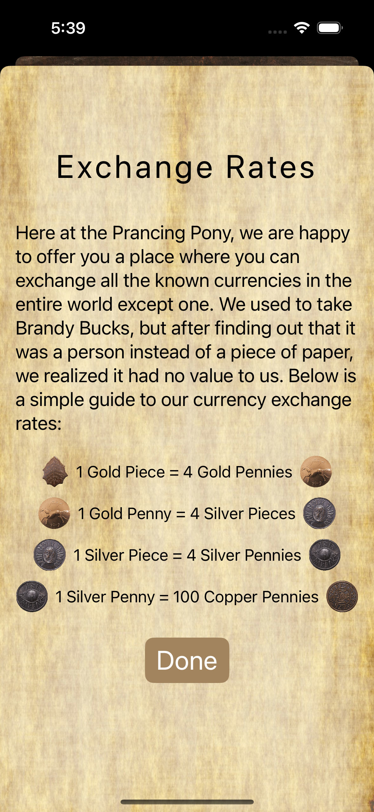
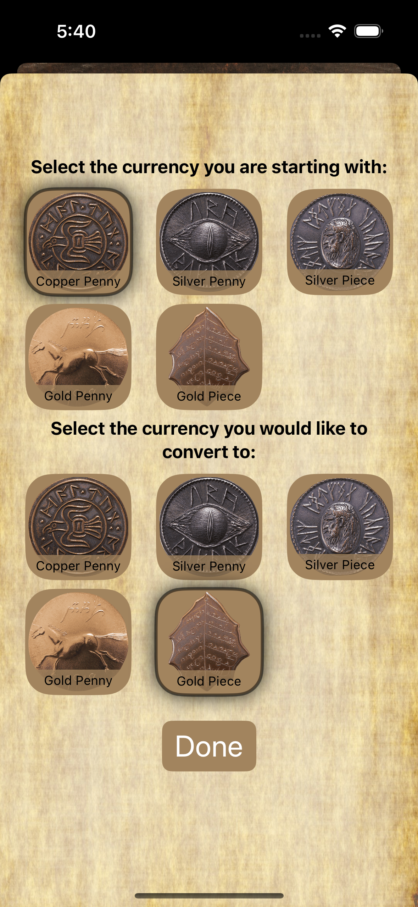

<div align="center">

# LOTR Currency Converter

[](https://developer.apple.com/swift/)
[](https://developer.apple.com/xcode/)
[](https://developer.apple.com/ios/)

  <div>
    &nbsp;&nbsp;&nbsp;
    &nbsp;&nbsp;&nbsp;
    
  </div>

</div>

## Overview
This SwiftUI project is a Lord of the Rings themed currency converter application. Here are the features:

- Convert between different Middle-earth currencies
- Interactive UI with custom backgrounds and icons
- Informative popover tips for improved user experience
- Persistent storage of user's last selected currencies

Based on the Udemy course [iOS 18, SwiftUI 6, & Swift 6: Build iOS Apps From Scratch](https://www.udemy.com/course/ios-15-app-development-with-swiftui-3-and-swift-5/), **with the following implementations by myself**:

- Added persistent storage for user preferences (last selected currencies)
- Integration of additional packages (as shown in [Packages](#packages)) to extend capabilities and streamline development
- Project structure layout (as shown in [Project Structure](#project-structure)) for better organization
- Improved code quality and functionality (as shown in [Enhancements and Refactoring](#enhancements-and-refactoring))

## Demo


## Packages
- [Inject](https://github.com/krzysztofzablocki/Inject) - Used for hot reloading during development

## Project Structure
- `Features/`: Contains the main feature of the app, Currency Exchange
  - `Views/`: Main views for the currency conversion interface
  - `Models/`: Data models and business logic
  - `Components/`: Reusable UI components
  - `Extensions/`: Swift extensions for additional functionality
  - `Tips/`: Custom tips for improved user experience

```
LOTRConverter/
├── LOTRConverterApp.swift
├── Assets.xcassets
├── Features/
│   └── CurrencyExchange/
│       ├── Views/
│       │   ├── CurrencyExchangeView.swift
│       │   ├── CurrencyExchangeInfoView.swift
│       │   └── CurrencySelectionView.swift
│       ├── Models/
│       │   └── CurrencyModel.swift
│       ├── Components/
│       │   ├── BackgroundView.swift
│       │   ├── CurrencyExchangeRateView.swift
│       │   ├── CurrencyIconGridView.swift
│       │   ├── CurrencyIconView.swift
│       │   └── CurrencyInputView.swift
│       ├── Extensions/
│       │   └── UserDefaultsExtension.swift
│       └── Tips/
│           └── CurrencySelectionTip.swift
```

## Enhancements and Refactoring
- Implemented a more modular project structure
- Created reusable UI components for improved maintainability
